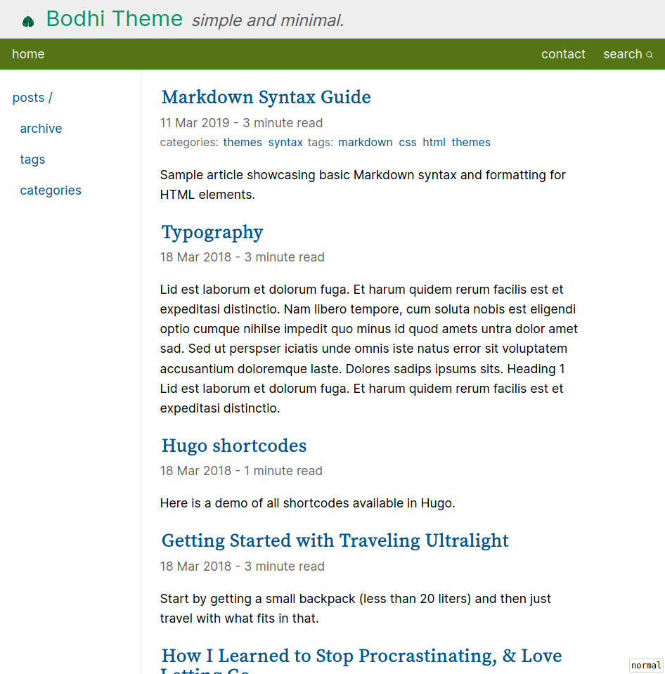

# Bodhi - Hugo Theme

Bodhi is a simple, minimal, personal website theme for Hugo.

[Demo](https://rohanverma.net/projects/bodhi) [Github](https://github.com/rhnvrm/bodhi)



## Features

- Google and Fathom Analytics integration
- Syntax highlighting
- Twitter cards and opengraph tags support
- Disqus and Commento comments
- RSS feeds
- AddToAny support
- Inbuilt Search Support
- Minimal post metadata like Reading Time
- Simple pagination with page indicators
- Two navigation menus
  - Menu bar with left/right split
  - Navigation bar with custom tree
- Included Archetypes (WIP)
  - Posts (for blogs)
  - Articles (for pages)

## Get Started

### Clone as submodule in your hugo site

```
git submodule add https://github.com/rhnvrm/bodhi themes/bodhi
```

### Sample Config

Update your hugo config.toml

You can use the following sample config file:

```toml
baseURL = "https://rohanverma.net/"
languageCode = "en-us"
title = "Rohan Verma"
theme = "bodhi"
googleAnalytics = "xxxx"

[params]
    subtitle = "(rhnvrm)"
    avatar = "/images/avatar.jpg"
    author = "Rohan Verma"
    commentoSrc = "https://commento.myselfhostedinstance.net/js/commento.js"
    footerMessage = "Feel free to use the content of this website with approripate attribution to the author."

[[menu.main]]
name = "home"
url = "/"
weight = 1

[[menu.main_right]]
name = "contact"
url = "/contact/"
weight = 1

[[menu.nav]]
name = "projects"
url = "/projects"
weight = 2

[[menu.nav]]
parent = "projects"
name = "bodhi"
url = "/projects/bodhi"
weight = 1

[[menu.nav]]
name = "blogs"
url = "/blog"
weight = 1

[[menu.nav]]
parent = "blogs"
name = "archive"
url = "/archive"
weight = 1

[[menu.nav]]
parent = "blogs"
name = "tags"
url = "/tags"
weight = 2

[[menu.nav]]
parent = "blogs"
name = "categories"
url = "/categories"
weight = 3

[markup.goldmark.renderer]
unsafe= true

[outputs]
  home = ["HTML", "RSS", "JSON"]

[params.fathomAnalytics]
    siteID = "XXXXX"
    serverURL = "https://fathom.myselfhostedinstance.net"

[markup]
  [markup.highlight]
    codeFences = true
    guessSyntax = true
    lineNoStart = 1
    noClasses = true
    style = "emacs"
    tabWidth = 4

```

## Previews

### Home Page


### Archive Page


### Inbuilt Search


### Syntax Highlighting


### Minimal Blog Metadata


### Simple but Responsive


## Inspiration

## suckless


[suckless](https://suckless.org) is known for their focus on simplicity and clarity. Their website is a good example of simple website design. I really liked how they use the two-column design as a mini-sitemap. This tree layout, is something that is familiar and intuitive to a lot of people. This inspired me to build [Bodhi](/projects/bodhi) to have a two-column layout with the column showing a tree like column on the left. 
